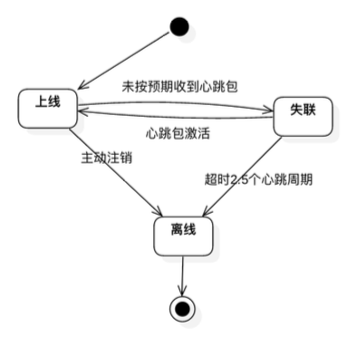

# scrapy-redis-loadbalancing
Expansion component of distributed dynamic load balancing base on Redis and Zookeeper for scrapy

基于Redis和Zookeeper的scrapy分布式动态负载均衡扩展组件

## 它能做什么
该项目是我的本科毕业设计, 解决了当年参加 "中国软件杯-分布式爬虫赛题" 我队遗留下来的负载均衡问题.

- 爬虫节点可以深居内网, 节省公网IP资源, **运营与维护成本更低**.
- 实现了动态负载均衡, **系统鲁棒性提升**.
	- 可依据各爬虫节点的**爬取性能不同, 分配合适的任务量**.
	- 可在**爬取过程中 新增\移除 爬虫节点** (即使新节点爬取性能存在差异).
- 减轻服务器交换与存储压力
	- 布隆过滤器 与 本地去重过滤器协作 (**减轻 URL判重压力**)
	- 远端任务队列 与 本地任务队列协作 (**减轻 种子存储压力**)
- 相比 scrapy-redis **吞吐量提升约 4.1 倍** (为实验测量结果, 实际情况会随网络延迟越大提升越高)
- 实现常见主流浏览器 UserAgent 自动轮换, 能一定程度上**反反爬虫**.

## 我做了什么
### 我所发现的:
在那段日子里我翻阅了大量的文献与资料，发现传统上几乎是通过类似多线程或是异步并发等方式，设法避开网络延迟带来的阻塞影响，这是一种提高吞吐量的可行方法，但是无法做到低成本。经过分析研究，发现分布式爬虫的通信开销主要在"URL判重"与"任务调度分配"上。因此解决性能瓶颈问题的核心在于如何充分利用有限的网络带宽与计算机软硬件资源，来减少"URL判重"与"任务调度分配"所带来的大量通信开销。

### 优化的思路:
我主要是通过突破了网络延迟带来的性能瓶颈！来提升分布式爬虫系统的性能，利用对等式架构的爬行器既是任务的消费者又是任务的生产者，提出了任务尽量在本地执行的优化方向。基于双缓冲技术实现的大粒度任务动态负载均衡策略，能有效的降低通信频次。基于CPU高速缓存原理的URL判重方案，以"空间换时间"的方式，有效的提升爬虫URL判重性能。

#### 主机发现:

#### 节点数量感知:

#### 节点状态感知:

#### 协同去重:

#### 负载均衡:

### 踩过的陷阱:

本次优化更多是考虑物理环境对吞吐量造成的影响而非算法本身！在探索过程中，我个人主观以为任务调度会是开销最大的部分。但是在测试的时候根本就没有提升什么性能！后来回归客观, 理性分析Scrapy运作过程, 发现了分布式爬虫系统各个组件串起来，就像一个管道系统，横截面最小的管子就成为了性能的瓶颈，后来明白这个道理以后去试了试优化URL判重部分，终于性能如愿大幅度提升了！

### 测试环境说明:
上文提到的实验结果基于 "2014款 Macbook Air" 作为实验环境, 采用三个节点构成的集群进行测试.

名称 | 配置
-------- | --------
CPU参数 | 1.4GHz Intel Core i5
内存参数 | 4GB 1600MHz DDR3
带宽限制 | 10Mpbs
网络延迟 | 10ms